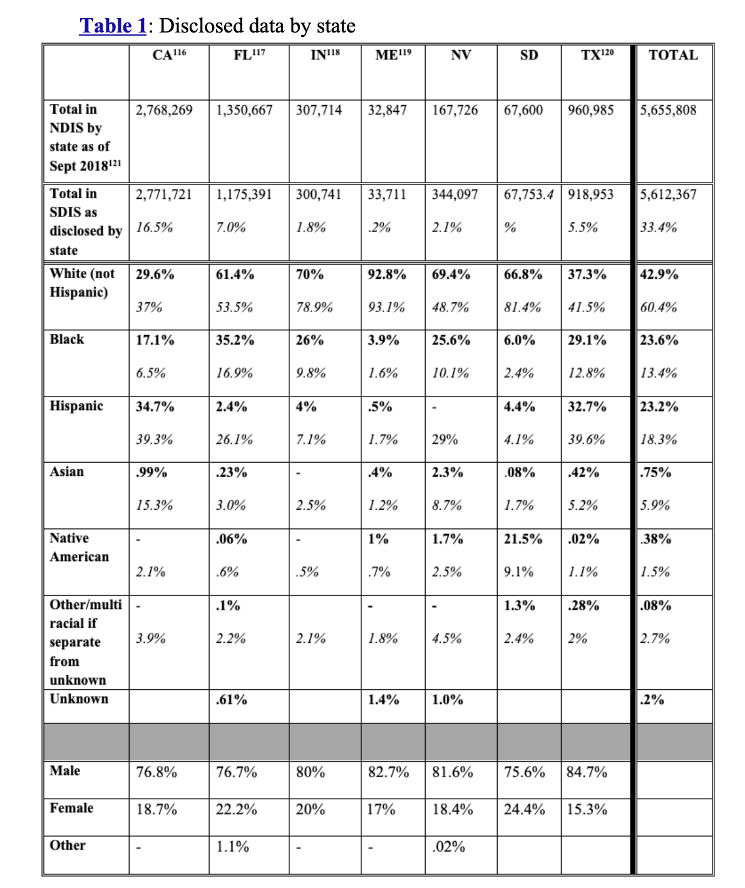
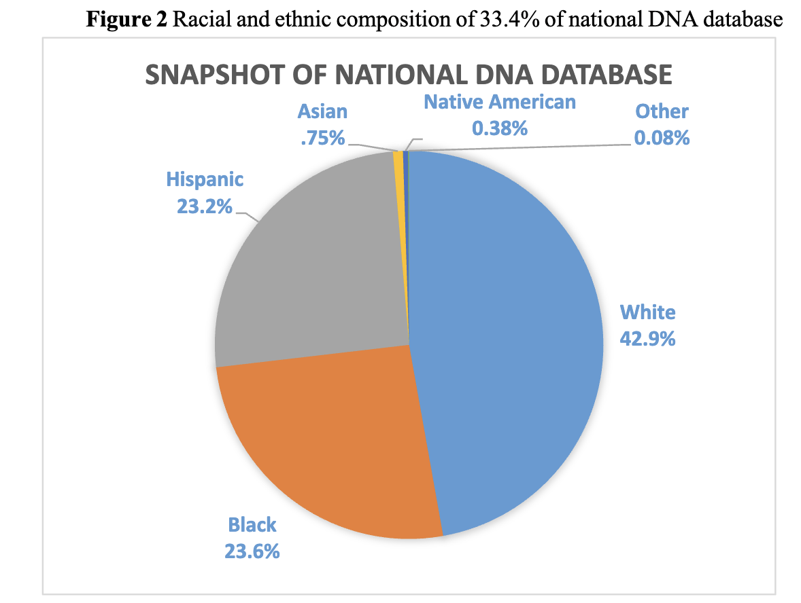
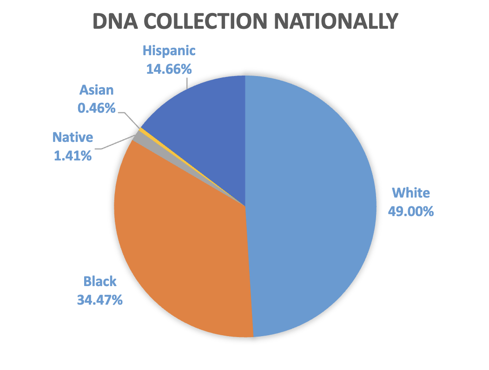

```{r setup, include=FALSE}
# load necessary libraries
library(dplyr)
library(tidyr)
library(ggplot2)
library(ggrepel)
```

In this analysis, we will replicate the figures and calculations from @murphy2020racial on racial demographics in forensic DNA databases. We will use the data provided in the annual DNA collection dataset, as well as the FOIA data on DNA profiles in state databases.

# Replicating Table 1: Racial Composition of DNA Databases from Seven States

## Overview of Table 1

Table 1 in the paper presents the disclosed data on the racial composition of DNA databases from seven states. The data is sourced from State DNA Index System (SDIS) through FOIA requests and includes the total number of known profiles in the National DNA Index System (NDIS), as well as the racial demographics in general populations from the U.S. Census Bureau. The original table is quoted below:



## Reproducing the Calculations

We will reproduce the calculations for Table 1 based on the the explanations provided in the paper.

### NDIS Profiles

The NDIS profiles are calculated by summing the arrestee and offender profiles for each state as of September 2018. We will also calculate the total number of NDIS profiles across all seven states.

> The first row shows the total number of known profiles in NDIS from each contributing state as of September 2018.

```{r}
#| tbl-cap: "NDIS profiles from the seven states as of September 2018"
# seven contributing states and two forensic profile types
states <- c("California", "Florida", "Indiana", "Maine", "Nevada", "South Dakota", "Texas")
forensic_profiles <- c("arrestee", "offender_profiles")
# read NDIS data (these numbers are obtained from the NDIS rather than SDIS)
ndis <- read.csv("../data/ndis/final/ndis_time_series.csv")
ndis_used <- ndis %>% select(asof_date, jurisdiction, metric_type, value) %>% filter(asof_date == "2018-09-01", jurisdiction %in% states, metric_type %in% forensic_profiles) %>% distinct()
ndis_profiles <- ndis_used %>% group_by(asof_date, jurisdiction) %>% summarise(total_NDIS_profiles = sum(value), .groups = "drop")
ndis_profiles <- ndis_profiles %>%
  bind_rows(
    summarise(.,
      asof_date = "2018-09-01",
      jurisdiction = "Total",
      total_NDIS_profiles = sum(total_NDIS_profiles)
    )
  )

ndis_profiles
```

### SDIS Profiles

The SDIS profiles are calculated based on the FOIA data obtained from the seven states.

> As of September 2018, the National Database contained 13,528,363 offender profiles (which are primarily from convicted persons, but also include certain detained persons and legally mandated samples) and 3,280,752 arrestee profiles, for a total of 16,809,115 profiles of known persons.

```{r}
#| tbl-cap: "Total NDIS profiles across all states as of September 2018"
# calculate total NDIS profiles for the U.S.
ndis_total <- ndis %>% select(asof_date, jurisdiction, metric_type, value) %>% filter(asof_date == "2018-09-01", metric_type %in% forensic_profiles) %>% distinct()
ndis_total_profiles <- ndis_total %>% group_by(asof_date, metric_type) %>% summarise(total_NDIS_profiles = sum(value), .groups = "drop")
ndis_total_profiles <- ndis_total_profiles %>%
  bind_rows(
    summarise(.,
      asof_date = "2018-09-01",
      metric_type = "Total",
      total_NDIS_profiles = sum(total_NDIS_profiles)
    )
  )
ndis_total_profiles
```

> The second row shows the number of profiles in SDIS from each state, as disclosed in the summer of 2018 by each listed state in response to our request. Within that row, in italics beneath the raw number of profiles, is the percentage of the NDIS database that those profiles represent.

The percentage of NDIS profiles represented by SDIS profiles is calculated by dividing the total number of SDIS profiles for each state by the total number of NDIS profiles across all states:
$$\text{Percentage of NDIS represented by SDIS} = \frac{\text{SDIS profiles for a state}}{\text{total NDIS profiles across all states}}.$$

```{r}
#| tbl-cap: "Total SDIS profiles from the seven states and their percentage of total NDIS profiles as of September 2018"
# read FOIA data on SDIS profiles from the seven states
sdis <- read.csv("../data/foia/final/foia_data_clean.csv")
sdis_total_profiles <- sdis %>% filter(state %in% states, offender_type == "Combined", variable_category == "total", value_type == "count") %>% select(state, value) %>% rename(total_SDIS_profiles = value)
sdis_total_profiles <- sdis_total_profiles %>%
  bind_rows(
    summarise(.,
      state = "Total",
      total_SDIS_profiles = sum(total_SDIS_profiles)
    )
  )
sdis_total_profiles <- sdis_total_profiles %>% mutate(percent_of_NDIS = round((total_SDIS_profiles / ndis_total_profiles$total_NDIS_profiles[ndis_total_profiles$metric_type == "Total"]) * 100, 1))
sdis_total_profiles
```

[Discrepancy: ]{style="color: red; font-weight: bold;"} For Nevada, the percentage is 2.0%, slightly different from the 2.1% reported in the paper. For South Dakota, the total SDIS profiles is 67,753, rather than the 67,753.4 reported in the paper. The percentage for South Dakota is 0.4%, not the missing value.

> The next rows show the percentage of the state’s database profiles that comes from each racial or ethnic group. Below each of those, in italics, is that group’s share of the general population in the state.

> The far-right column represents total data. The top numbers represent the totals as a percentage of the disclosed data, whereas the bottom numbers represent the totals as a reflection of the national population. Thus, for instance, the box where the “Total” column meets the “Black” row shows that 23.6% of the profiles from the disclosed data came from persons identified as Black, whereas only 13.4% of the national U.S. population identifies as Black.

The top number in the "Total" column is calculated by taking the weighted average of the percentages of SDIS profiles from each racial or ethnic group across the seven states, using the total number of SDIS profiles from each state as weights. The weighted average is calculated as follows:
$$\begin{align}
& \text{SDIS Weighted Average}  = \frac{\sum_{i=1}^{7} \text{Total SDIS profiles for a racial group in state } i }{\sum_{i=1}^{7} \text{Total SDIS profiles in state } i} \\
& = \frac{\sum_{i=1}^{7} (\text{SDIS percentages for a racial group in state } i \times \text{Total SDIS profiles in state } i)}{\sum_{i=1}^{7} \text{Total SDIS profiles in state } i}. \\
\end{align}
$$

```{r}
#| tbl-cap: "Percentage of SDIS profiles from each racial or ethnic group for each state and their weighted average across the seven states, using the total number of SDIS profiles from each state as weights"
# calculate the percentage of SDIS profiles from each racial or ethnic group for each state
sdis_racial_profiles <- sdis %>% filter(state %in% states, offender_type == "Combined", variable_category == "race", value_type == "percentage") %>% select(state, variable_detailed, value) %>% rename(race = variable_detailed, percent_SDIS_profiles = value)

races <- c(
  "White", 
  "Black", 
  "Hispanic", 
  "Asian", 
  "Native American", 
  "Other",
  "Unknown"
)
# Pivot the long dataframe into a wide format
sdis_racial_profiles_wide <- sdis_racial_profiles %>%
  pivot_wider(
    names_from = state, 
    values_from = percent_SDIS_profiles
  )

sdis_racial_profiles_wide <- sdis_racial_profiles_wide %>%
  mutate(race = factor(race, levels = races)) %>%
  arrange(race)

# Extract just the states and their total profiles
state_weights <- sdis_total_profiles %>%
  filter(state != "Total") %>%
  select(state = state, weight = total_SDIS_profiles)

# Calculate the weighted average for each race
weighted_calculations <- sdis_racial_profiles %>%
  left_join(state_weights, by = "state") %>%
  group_by(race) %>%
  summarise(
    Total = sum(percent_SDIS_profiles * weight, na.rm = TRUE) / 
                       sum(weight, na.rm = TRUE)
  )

# Attach the new column to your wide table
sdis_racial_profiles_wide <- sdis_racial_profiles_wide %>%
  left_join(weighted_calculations, by = "race")

sdis_racial_profiles_wide
```

[Discrepancy: ]{style="color: red; font-weight: bold;"} For the Other race, the percentage of SDIS profiles in Indiana is calculated as 0.498%, not the missing value in the paper. For the Unknown race, the percentages of SDIS profiles in California, South Dakota and Texas are 17.7%, 1.32%, and 0.24%, respectively, not the missing value in the paper. The weighted averages for the Hispanic, Asian, Native American, Other and Unknown categories are 24.8%, 0.796%, 0.848%, 0.219%, 9.49%, respectively, slightly different from the 23.2%, 0.75%, 0.38%, 0.08%, 0.02% reported in the paper.

> States also disclosed demographic information about sex, which isprovided in the lowest rows.

```{r}
#| tbl-cap: "Percentage of SDIS profiles from each gender for each state"
# calculate the percentage of SDIS profiles from each gender for each state
sdis_gender_profiles <- sdis %>% filter(state %in% states, offender_type == "Combined", variable_category == "gender", value_type == "percentage") %>% select(state, variable_detailed, value) %>% rename(gender = variable_detailed, percent_SDIS_profiles = value)
sdis_gender_profiles_wide <- sdis_gender_profiles %>%
  pivot_wider(
    names_from = state, 
    values_from = percent_SDIS_profiles
  ) %>%
  arrange(gender)
genders <- c("Male", "Female", "Unknown")
sdis_gender_profiles_wide <- sdis_gender_profiles_wide %>%
  mutate(gender = factor(gender, levels = genders)) %>%
  arrange(gender)

sdis_gender_profiles_wide
```

### Census Data

The clean Census data is not stored in the POFRIDGE database, so we will not be able to reproduce the exact table for the general population demographics.

> All general population demographic data are taken from www.census.gov, which draws from an array of sources.

> United States, U.S. CENSUS BUREAU (July 1, 2019), www.census.gov/quickfacts/ [https://perma.cc/NQS7-VX2N] (in the search bar at the top left, type in the name of each state). The figures for the “White” population are drawn from the census figure for “White alone, not Hispanic or Latino.” There are no figures for other racial groups that exclude “Hispanic or Latino,” so the population percentages reported for those groups may include persons who identify both with the race listed and as Hispanic.

# Replicating Figure 2: Racial and ethnic composition of 33.4% of national DNA database

## Overview of Figure 2

Figure 2 in the paper presents the racial and ethnic composition of the 33.4% of the national DNA database that is represented by the SDIS profiles from the seven states. The original figure is quoted below:



## Reproducing the Calculations

The numbers in Figure 2 are straightforward to obtain based on the far-right "Total" column from Table 1.

1. The 33.4% is the percentage of NDIS profiles represented by the SDIS profiles from the seven states, which is calculated by dividing the total number of SDIS profiles across all seven states by the total number of NDIS profiles across all states.

2. The racial composition is the top numbers in the "Total" column from Table 1, which are calculated as the weighted average of the percentages of SDIS profiles from each racial or ethnic group across the seven states, using the total number of SDIS profiles from each state as weights.


```{r}
# Prepare the data without changing the order
plot_data <- sdis_racial_profiles_wide %>%
  select(race, Total) %>%
  mutate(
    race = factor(race, levels = races), # Ensure the order is the same as in the original data
    pie_label = paste0(race, "\n", round(Total, 2), "%")
  )

# Build the chart using ggrepel and position_stack
ggplot(plot_data, aes(x = 1, y = Total, fill = race)) +
  geom_bar(stat = "identity", width = 1, color = "white") +
  coord_polar("y", start = 0) +
  # Use the automatic stacking position with ggrepel
  geom_label_repel(
    aes(label = pie_label),
    position = position_stack(vjust = 0.5), 
    size = 4,
    show.legend = FALSE
  ) +
  theme_void() +
  theme(legend.position = "none") +
  labs(
    title = "Racial and ethnic composition of 33.4% of national DNA database",
    subtitle = "Replication of Figure 2 from Murphy and Tong (2020)"
  )
```

# Replicating Figure 4 bottom panel: Estimated racial breakdown of the DNA collected nationally

NDIS profiles do not provide information on the racial demographics for each state, and the FOIA data on SDIS profiles only covers seven states. However, @murphy2020racial estimates the racial breakdown of the NDIS profiles by using the annual DNA collection dataset, which includes the percentage of DNA profiles collected annually from each racial group for each state.

## Overview of Figure 4 bottom panel

Figure 4 bottom panel in the paper presents the estimated racial breakdown of the DNA collected nationally, which is calculated by taking the weighted average of the percentages of DNA profiles collected annually from each racial group across all states, using the total number of NDIS profiles from each state as weights. The original figure is quoted below:



## Reproducing the Calculations

> The racial breakdown of the DNA database in Figure 4 assumes that the racial breakdown of the DNA collected annually for each state is the same as that of the total DNA profiles collected by each state, as disclosed by the National DNA Index. We aggregated the data for the states to create the racial breakdown for the total DNA profiles nationally.


```{r}
#| tbl-cap: "Estimated racial breakdown of NDIS profiles for each state, using the racial breakdown of the DNA collected annually for each state"
# read the annual DNA collection dataset
annual_dna_collection <- read.csv("../data/annual_dna_collection/final/Annual_DNA_Collection.csv")

annual_dna_profiles <- annual_dna_collection %>% select(state, White_DNA_Pct, Black_DNA_Pct, Hispanic_DNA_Pct, Asian_DNA_Pct, Native_American_DNA_Pct, Total_DNA_Profiles)

# read the NDIS data to get the total number of NDIS profiles for each state
ndis_all_profiles <- ndis_total %>% group_by(asof_date, jurisdiction) %>% summarise(total_NDIS_profiles = sum(value), .groups = "drop") %>% rename(state = jurisdiction) %>% select(state, total_NDIS_profiles)

annual_dna_profiles <- annual_dna_profiles %>% left_join(ndis_all_profiles, by = c("state" = "state"))

annual_dna_profiles
```

The estimated racial breakdown of the DNA collected nationally is calculated by taking the weighted average of the percentages of DNA profiles collected annually from each racial group across all states, using the total number of NDIS profiles from each state as weights. The weighted average is calculated as follows:
$$\begin{align}
& \text{NDIS Weighted Average}  = \frac{\sum_{i=1}^{50} \text{Total NDIS profiles for a racial group in state } i }{\sum_{i=1}^{50} \text{Total NDIS profiles in state } i} \\
& = \frac{\sum_{i=1}^{50} (\text{Annual DNA collection percentages for a racial group in state } i \times \text{Total NDIS profiles in state } i)}{\sum_{i=1}^{50} \text{Total NDIS profiles in state } i}. \\
\end{align}
$$

```{r}
# Calculate the weighted average for all racial percentage columns
weighted_racial_breakdown <- annual_dna_profiles %>%
  summarise(
    across(
      .cols = ends_with("_DNA_Pct"),
      .fns = ~ weighted.mean(.x, w = total_NDIS_profiles, na.rm = TRUE)
    )
  )

ndis_racial_breakdown <- weighted_racial_breakdown %>%
  pivot_longer(cols = everything(), names_to = "race", values_to = "Total") %>%
  mutate(race = case_when(
    race == "White_DNA_Pct" ~ "White",
    race == "Black_DNA_Pct" ~ "Black",
    race == "Hispanic_DNA_Pct" ~ "Hispanic",
    race == "Asian_DNA_Pct" ~ "Asian",
    race == "Native_American_DNA_Pct" ~ "Native American"
  ))


# Prepare the data without changing the order
plot_data <- ndis_racial_breakdown %>%
  select(race, Total) %>%
  mutate(
    race = factor(race, levels = races), # Ensure the order is the same as in the original data
    pie_label = paste0(race, "\n", round(Total, 2), "%")
  )

# Build the chart using ggrepel and position_stack
ggplot(plot_data, aes(x = 1, y = Total, fill = race)) +
  geom_bar(stat = "identity", width = 1, color = "white") +
  coord_polar("y", start = 0) +
  # Use the automatic stacking position with ggrepel
  geom_label_repel(
    aes(label = pie_label),
    position = position_stack(vjust = 0.5), 
    size = 4,
    show.legend = FALSE
  ) +
  theme_void() +
  theme(legend.position = "none") +
  labs(
    title = "Estimated racial breakdown of the DNA collected nationally",
    subtitle = "Replication of Figure 4 bottom panel from Murphy and Tong (2020)"
  )
```

[Discrepancy: ]{style="color: red; font-weight: bold;"} The estimated racial breakdown of the DNA collected nationally is slightly different from the original figure. The percentages for White, Black, Hispanic, Asian and Native American are 48.96%, 34.49%, 16.61%, 0.97% and 2.08%, respectively, compared to the 49.00%, 34.47%, 14.66%, 0.46% and 1.41% reported in the paper.


# References

::: {#refs}
:::